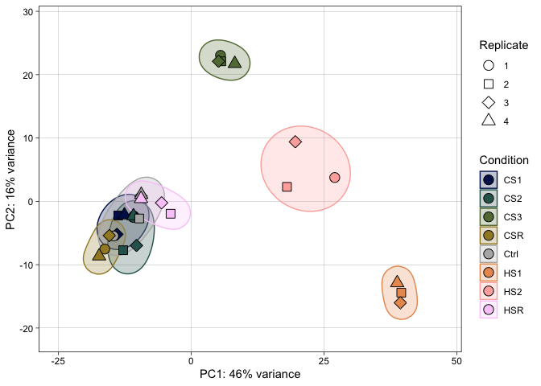

Documentation of data analysis
================


This document provides a general workflow and overview of the tools and
custom R scripts used for the analysis.

------------------------------------------------------------------------

#### Table of Contents

- <a href="#differential-gene-expression-analysis-using-deseq2"
  id="toc-differential-gene-expression-analysis-using-deseq2">Differential
  gene expression analysis using <code>DESeq2</code></a>
- <a href="#identification-of-enriched-3-ends-from-term-seq-data"
  id="toc-identification-of-enriched-3-ends-from-term-seq-data">Identification
  of enriched 3’ ends from Term-seq data</a>
- <a href="#coverage-analysis-of-long-nanopore-reads"
  id="toc-coverage-analysis-of-long-nanopore-reads">Coverage analysis of
  long Nanopore reads</a>
- <a href="#differential-protein-expression-analysis-using-limma"
  id="toc-differential-protein-expression-analysis-using-limma">Differential
  protein expression analysis using <code>limma</code></a>
- <a href="#downstream-data-analysis"
  id="toc-downstream-data-analysis">Downstream data analysis</a>
  - <a href="#normalisation" id="toc-normalisation">Normalisation</a>
  - <a href="#arcog-enrichment-analyis"
    id="toc-arcog-enrichment-analyis">arCOG enrichment analyis</a>
  - <a href="#promoter-and-terminator-analysis"
    id="toc-promoter-and-terminator-analysis">Promoter and terminator
    analysis</a>
  - <a href="#correlation-analysis"
    id="toc-correlation-analysis">Correlation analysis</a>
  - <a href="#detection-and-analysis-of-signature-clusters"
    id="toc-detection-and-analysis-of-signature-clusters">Detection and
    analysis of signature clusters</a>
- <a href="#tools-used" id="toc-tools-used">Tools used</a>

------------------------------------------------------------------------

### Differential gene expression analysis using `DESeq2`

The following pipeline was used to analyze RNA-seq data:

1.  Raw sequencing reads in fastq format were filtered and trimmed for
    quality using fastp v. 0.23.2 to remove low-quality bases and
    adapter sequences (–cut_front –cut_tail -q 30).

> To reproduce the results, you can download the gzipped RNA-seq fastq
> data from the European Nucleotide Archive stored under project
> accession number
> [PRJEB61174](https://www.ebi.ac.uk/ena/browser/view/PRJEB61174) and
> move them to the `"/path/to/working/directory/raw"` directory.

Note that the working directory (`"/path/to/working/directory/`) refers
to <https://github.com/felixgrunberger/HSCS_Pfu/data>.

``` bash
#!/bin/bash

# Define the working directory
ws="/path/to/working/directory"

# Loop through all FASTQ files in the "raw" directory
for file in "${ws}/raw*"/*.fastq.gz; do 
  # Extract the filename without the path and extension
  filename=$(basename "${file}" .fastq.gz)
  
  # Create the output directory if it doesn't exist
  mkdir -p "${ws}/fastp_trimmed/"
  
  # Trim the reads using fastp (index primer 12 and 29 detected by FastQC)
  fastp --cut_front --cut_tail -q 30 \
        --adapter_fasta "${ws}/adapters/indexprimer.fa" \
        -i "${file}" \
        -o "${ws}/fastp_trimmed/${filename}_trimmed.fastq.gz"
  
  # Print a message when the trimming is finished
  echo "${filename} trimming finished"
done
```

2.  Ribosomal RNA reads were removed using sortmeRNA v. 4.3.6 based on
    sequences in the [SILVA database](https://www.arb-silva.de).

``` bash
#!/bin/bash

# Set workspace directory
ws="/path/to/workspace"

# Create sortmerna index database
indexdb_rna --ref \
${ws}/silva/PFDSM3638_RS00585_16S.fasta,${ws}/silva/PFDSM3638_RS00585_16S-db \
${ws}/silva/PFDSM3638_RS00595_23S.fasta,${ws}/silva/PFDSM3638_RS00595_23S-db \
${ws}/silva/PFDSM3638_RS07475_5S.fasta,${ws}/silva/PFDSM3638_RS07475_5S-db \
${ws}/silva/PFDSM3638_RS08510_5S.fasta,${ws}/silva/PFDSM3638_RS08510_5S-db

# Loop over all fastq files in the specified directory
for file in ${ws}/fastp_trimmed/*trimmed.fastq.gz
do 
  # Extract filename without extension
  filename=$(basename "${file%.fastq.gz}")

  # Create required directories
  mkdir -p ${ws}/unpigz
  mkdir -p ${ws}/sortmerna
  mkdir -p ${ws}/sortmerna_log
  
  # Decompress fastq.gz file
  unpigz --keep --stdout --decompress $file > ${ws}/unpigz/temp1.fastq

  # Run sortmerna
  sortmerna \
  --threads 16 \
  --ref ${ws}/silva/PFDSM3638_RS00585_16S-db \
  --ref ${ws}/silva/PFDSM3638_RS00595_23S-db \
  --ref ${ws}/silva/PFDSM3638_RS07475_5S-db \
  --ref ${ws}/silva/PFDSM3638_RS08510_5S-db \
  --reads ${ws}/unpigz/temp1.fastq \
  --aligned ${ws}/sortmerna/"$filename"_rRNA \
  --other ${ws}/sortmerna/"$filename"_RNA \
  --fastx \
  --log ${ws}/sortmerna_log/"$filename".log 

  # Compress output file
  pigz --best ${ws}/sortmerna/"$filename"_RNA.fq

  # Clean up
  rm ${ws}/sortmerna/"$filename"_rRNA.fq
  rm -R ${ws}/unpigz
  rm -R ${ws}/sortmerna

  # Print message indicating that sortmerna has finished
  echo $filename "sortmerna finished" 
done
```

3.  The rRNA-depleted reads were aligned to the *Pyrococcus furiosus*
    DSM 3638 reference genome (NCBI: CP023154.1) using Bowtie2 v. 2.5.0
    with default parameters. The resulting sequence alignment files
    (SAM) were converted to binary mapping format (BAM) using samtools.

``` bash
#!/bin/bash

# Set workspace directory
ws="/path/to/workspace"

# Build genome index
bowtie2-build ${ws}/genome/GCF_008245085.1_ASM824508v1_genomic.fna ${ws}/genome/GCF_008245085.1_ASM824508v1_genomic
    
# Loop through all sorted and filtered rRNA reads files
for file in ${ws}/sortmerna/*.fq.gz; do 
    # Extract the file name and remove extension
    filename=$(basename "$file")
    short=$(echo $filename | sed s/"_trimmed_RNA"//)
  
    # Create directory for mapped files
    mkdir -p ${ws}/mapped/${short}
  
    # Align reads to reference genome using Bowtie2
    bowtie2 --threads 16 \
        -x ${ws}/genome/GCF_008245085.1_ASM824508v1_genomic \
        -U $file \
        -S ${ws}/mapped/${short}/${short}.sam 2>${ws}/mapped/${short}/${short}.log
  
    # Convert SAM file to BAM file and filter by mapping quality
    samtools view -@ 16 -bS ${ws}/mapped/${short}/${short}.sam \
        > ${ws}/mapped/${short}/${short}.bam
    samtools view -@ 16 -b -q 5 ${ws}/mapped/${short}/${short}.bam \
        > ${ws}/mapped/${short}/${short}.filtered.bam
  
    # Sort the filtered BAM file and create index
    samtools sort -@ 16 ${ws}/mapped/${short}/${short}.filtered.bam \
        -o ${ws}/mapped/${short}/${short}.sorted.bam
    samtools index -@ 16 ${ws}/mapped/${short}/${short}.sorted.bam

    # Remove temporary files
    rm ${ws}/mapped/${short}/${short}.sam
    rm ${ws}/mapped/${short}/${short}.bam
    rm ${ws}/mapped/${short}/${short}.filtered.bam

    # Print a message indicating that mapping is finished for the current file
    echo "Mapping for ${short} is finished."
done
```

4.  Differentially expressed genes were identified using DESeq2 package
    following the recommendations in the Bioconductor vignette.

5.  FeatureCounts from RSubread package v. 2.10.5 was used to calculate
    the count matrix based on a custom GTF file generated by filtering
    the *P. furiosus* DSM 3638 GFF annotation file downloaded from NCBI
    for protein-coding genes (column biotype).

> You can find the R code used for calculation of the count matrix
> analysis under
> [Rscripts/featurecounts.R](../Rscripts/featurecounts.R). The matrix is
> saved under [data/Rdata](../data/Rdata).

6.  Principal component analysis (PCA) was performed on variance
    stabilizing transformed (VST) data, and outlier replicates were
    removed from the dataset after visual inspection.

``` r
# load libraries ----
library(here)
source(here("Rscripts/load_libraries.R"))

# data ----
## read in DESeq object ====
load(here("data/Rdata/dds_start.Rdata"))

## normalisation ====
vsd <- vst(dds, blind=FALSE)

# remove outliers after plotting ----
## PCA ===
ad <- plotPCA(vsd,intgroup = c("Condition", "bio_rep"))
ggad <- as_tibble(ad$data) 

ggplot(ggad, 
       aes(x = PC1, y = PC2, fill = Condition, group = Condition, 
           shape = as.factor(bio_rep))) +
  geom_mark_ellipse(aes(color = Condition, group = Condition), 
                    alpha = 0.25) +
  geom_point(size = 4, color = "black") +
  scale_shape_manual(values = c(21, 22, 23, 24), name = "Replicate") +
  guides(fill = guide_legend(override.aes=list(shape=c(21))),
         shape = guide_legend(override.aes=list(shape=c(21,22,23,24),
                                                fill = "white"))) +
  theme_linedraw() +
  scale_color_manual(values = batlow_custom) +
  scale_fill_manual(values = batlow_custom) +
  theme(panel.grid.minor = element_blank()) +
  xlab(ad$labels$x) +
  ylab(ad$labels$y)
```

<!-- -->

After visual inspection the following replicates were removed and a new
DESeq object created.

``` r
## sample ids ====
sample_ids    <- read_xlsx(here("data/samples/sample_id_info.xlsx")) %>%
  dplyr::mutate(Condition = case_when(Condition == "CS_short" ~ "CS1",
                                      Condition == "CS_middle" ~ "CS2",
                                      Condition == "CS_long" ~ "CS3",
                                      Condition == "CS_Rec_short" ~ "CSR",
                                      Condition == "Ctrl" ~ "Ctrl",
                                      Condition == "HS1" ~ "HS1",
                                      Condition == "HS2" ~ "HS2",
                                      Condition == "HS3" ~ "HSR")) 

### load pre-calculated featurecounts object ====
load(here("data/Rdata/featurecounts_rnaseq.Rdata"))
sample_design <- colnames(counts)

## remove replicates after PCA ====
remove_rna_samples <- data.table(Condition = c("HS1", "HS2", "HSR", "CSR"),
                                 bio_rep = c(1, 4, 1, 2),
                                 remove = T) %>%
  left_join(sample_ids, multiple = "all") %>%
  dplyr::select(sample_ids) %>%
  deframe()

## Start again from PCA ====
colDataRaw2 <- data.table(sample_ids = sample_design) %>%
  left_join(sample_ids) %>%
  dplyr::filter(!is.na(Condition),
                !sample_ids %in% remove_rna_samples) 

## DESeq object ====
### calc DESeq2 ####
dds2 <- DESeq2::DESeqDataSetFromMatrix(countData = counts[,colnames(counts) %in% colDataRaw2$sample_ids], 
                                       colData = colDataRaw2,
                                       design = ~Condition)

dds2 <- dds2[rowSums(counts(dds2)) > 1,]
dds_adjusted2 <- estimateSizeFactors(dds2)

### get normalized counts table ####
normalized_counts2 <- counts(dds_adjusted2, normalized = T)
vroom_write(normalized_counts2 %>%
              as.data.frame() %>%
              rownames_to_column("gene"), 
            here("data/Rdata/deseq_normalized_counts.tsv"))

### normalization ####
vsd2 <- vst(dds2, blind = FALSE)
ad2 <- plotPCA(vsd2,intgroup = c("Condition", "bio_rep"))
ggad2 <- as_tibble(ad2$data) 

# plot ----
ggplot(ggad2, 
       aes(x = PC1, y = PC2, fill = Condition, group = Condition, 
           shape = as.factor(bio_rep))) +
  geom_mark_ellipse(aes(color = Condition, group = Condition), 
                    alpha = 0.25) +
  geom_point(size = 4, color = "black") +
  scale_shape_manual(values = c(21, 22, 23, 24), name = "Replicate") +
  guides(fill = guide_legend(override.aes=list(shape=c(21))),
         shape = guide_legend(override.aes=list(shape=c(21,22,23,24),
                                                fill = "white"))) +
  theme_linedraw() +
  scale_color_manual(values = batlow_custom) +
  scale_fill_manual(values = batlow_custom) +
  scale_x_continuous(expand = c(.2,0)) +
  scale_y_continuous(expand = c(.2,0)) +
  theme(panel.grid.minor = element_blank()) +
  xlab(ad2$labels$x) +
  ylab(ad2$labels$y) 
```

<!-- --> After removal
of the replicates, the count data were saved:

``` r
### genes ####
pfu_gff <- read.gff(here("data/genome/GCF_008245085.1_ASM824508v1_genomic.gff")) %>%
  dplyr::filter(type == "gene") %>%
  dplyr::mutate(locus_tag = str_split_fixed(str_split_fixed(attributes, ";old_",2)[,1],"locus_tag=",2)[,2],
                old_locus_tag = str_split_fixed(attributes, "old_locus_tag=",2)[,2],
                width = abs(start-end),
                biotype = str_split_fixed(str_split_fixed(attributes, "gene_biotype=",2)[,2],";locus_tag=",2)[,1]) %>%
  dplyr::filter(biotype == "protein_coding") %>%
  dplyr::select(locus_tag,old_locus_tag,start, end, strand,width, biotype)

### save unnormalized counts ####
counts_remBad <- counts[,colnames(counts) %in% colDataRaw2$sample_ids]
save(counts_remBad,
     file = here("data/Rdata/featurecounts_rnaseq_remBad.Rdata"))

### save unnormalized counts ####
featurecounts_rem_bad_table <- counts_remBad %>%
  as.data.frame() %>%
  rownames_to_column("gene") %>%
  pivot_longer(-gene, names_to = "set", values_to = "counts") %>%
  left_join(sample_ids, by = c("set" = "sample_ids")) %>%
  left_join(pfu_gff, by = c("gene" = "locus_tag")) %>%
  group_by(Condition, gene) %>%
  summarise(Mean_counts = mean(counts, na.rm = T))
save(featurecounts_rem_bad_table,
     file = here("data/Rdata/featurecounts_rem_bad_table.Rdata"))

### save TPM normalized counts ####
normalized_counts_rem_bad_table <- normalized_counts2 %>%
  as.data.frame() %>%
  rownames_to_column("gene") %>%
  pivot_longer(-gene, names_to = "set", values_to = "counts") %>%
  left_join(sample_ids, by = c("set" = "sample_ids")) %>%
  left_join(pfu_gff %>%
              dplyr::rename(gene = locus_tag), multiple = "all") %>%
  mutate(rpk = counts/(width/1000)) %>%
  group_by(set) %>%
  mutate(scaling_factor = sum(rpk, na.rm = T)/1000000) %>%
  ungroup() %>%
  mutate(tpm = rpk/scaling_factor) %>%
  group_by(Condition, gene) %>%
  summarise(Mean_tpm = mean(tpm, na.rm = T))
save(normalized_counts_rem_bad_table,
     file = here("data/Rdata/normalized_counts_rem_bad_table.Rdata"))
```

7.  Differential expression analysis was conducted by comparing each of
    the cold or heat shock conditions with the control condition in a
    pairwise manner.

``` r
# functions ----
diff_exp <- function(selector, counts_input = counts_remBad, colData_input = colDataRaw2){
  
  sample_info_select1 <- sample_ids %>% 
    dplyr::filter(Condition %in% "Ctrl")
  
  sample_info_select2 <- sample_ids %>% 
    dplyr::filter(Condition %in% wanted[selector])
  
  templist1 <- which(stringr::str_detect(string = colnames(counts_input), pattern = paste(sample_info_select1$sample_ids,collapse = "|")))
  templist2 <- which(stringr::str_detect(string = colnames(counts_input), pattern = paste(sample_info_select2$sample_ids,collapse = "|")))
  
  dds_obj <- DESeq2::DESeqDataSetFromMatrix(countData = counts_input[,c(templist1,templist2)], 
                                            colData = colData_input[c(templist1,templist2),],
                                            design = ~Condition) %>%
    DESeq()
  
  
  res_final <- lfcShrink(dds_obj, 
                         coef = resultsNames(dds_obj)[2], 
                         type = "apeglm") %>%
    as.data.frame() %>%
    rownames_to_column("gene") %>%
    mutate(comp = resultsNames(dds_obj)[2],
           set1 = str_split_fixed(str_remove_all(comp, "Condition_"),"_vs_", 2)[,1],
           set2 = str_split_fixed(str_remove_all(comp, "Condition_"),"_vs_", 2)[,2],
           log2FoldChange = case_when(set1 == "Ctrl" ~ -log2FoldChange,
                                      set1 != "Ctrl" ~ log2FoldChange,
                                      set2 == "Ctrl" ~ log2FoldChange,
                                      set2 != "Ctrl" ~ -log2FoldChange),
           padj = if_else(!is.na(padj), padj, 1),
           pvalue = if_else(!is.na(pvalue), pvalue, 1),
           typeReg = ifelse(log2FoldChange > 0 & padj < 0.05, "up", 
                            ifelse(log2FoldChange < 0 & padj < 0.05, "down",
                                   ifelse(is.na(padj), "up","not significant")))) %>%
    dplyr::rename(log2FC = log2FoldChange)
  
  return(res_final)
}

# data ----
## genome annotation file ====
pfu_gff <- read.gff(here("data/genome/GCF_008245085.1_ASM824508v1_genomic.gff")) %>%
  dplyr::filter(type == "gene") %>%
  dplyr::mutate(locus_tag = str_split_fixed(str_split_fixed(attributes, ";old_",2)[,1],"locus_tag=",2)[,2],
                old_locus_tag = str_split_fixed(attributes, "old_locus_tag=",2)[,2],
                width = abs(start-end),
                biotype = str_split_fixed(str_split_fixed(attributes, "gene_biotype=",2)[,2],";locus_tag=",2)[,1]) %>%
  dplyr::filter(biotype == "protein_coding") %>%
  dplyr::select(locus_tag,old_locus_tag,start, end, strand,width, biotype)

pfu_arcog <- vroom(here("data/genome/arcog_pfu_table_new.txt"))

pfu_annotation <- pfu_gff %>%
  left_join(pfu_arcog, by = c("old_locus_tag" = "new")) 

pfu_annotation_small <- pfu_annotation %>%
  distinct(locus_tag, .keep_all = T) %>%
  dplyr::rename(pf_name = Synonym,
                description = name) %>%
  dplyr::select(locus_tag, old_locus_tag, pf_name, description)
vroom_write(pfu_annotation_small, here("data/Rdata/pfu_annotation_small.tsv"))

## RNAseq ====
### load counts table ####
load(here("data/Rdata/featurecounts_rnaseq_remBad.Rdata"))

### run through all sets ####
wanted <- levels(as.factor(sample_ids$Condition))
wanted <- wanted[!wanted %in% c("Ctrl")]
rna_diff <- pmap_dfr(list(1:length(wanted)), diff_exp)

rna_diff_f <- rna_diff %>%
  dplyr::mutate(Condition = if_else(set1 != "Ctrl", set1, set2)) %>%
  left_join(pfu_annotation_small, by = c("gene" = "locus_tag")) %>%
  distinct()

comp_table_RNA <- rna_diff %>%
  dplyr::mutate(Condition = if_else(set1 != "Ctrl", set1, set2)) %>%
  dplyr::select(gene, log2FC, padj, typeReg, Condition)

vroom::vroom_write(comp_table_RNA, 
                   file = here("data/Rdata/comp_table_RNA.tsv"))
```

### Identification of enriched 3’ ends from Term-seq data

1.  Quality and adapter trimming of the raw fastq files was performed
    using trimmomatic in paired-end mode, with the following settings:
    ILLUMINACLIP:TruSeq3-PE.fa:2:30:10:8:true, AVGQUAL:25, MINLEN:20.

2.  Unique molecular identifiers (UMIs) were extracted from the
    paired-end reads using the umi_tools command (–bcpattern=NNNN,
    –bc-pattern2=NNNN).

3.  Mapping of the reads to the reference genome was performed using
    bowtie2 in –sensitive-local mode with the last four nucleotides of
    each read being trimmed using –trim3 4. SAM files were then
    converted to BAMs, sorted and indexed using samtools.

4.  Deduplication of mapped reads was performed using the extracted UMIs
    by umi_tools dedup with default settings for paired-end data.

5.  Detection of enriched 3’ ends by peak calling and downstream
    analysis was performed as follows:

    1.  Strand-specific bedgraph files were generated and CPM normalized
        using deepTools bamCoverage, with the SAM flags 83 and 99 in
        combination with –Offset 1 and –binSize 1 –minMappingQuality 20.
    2.  The termseq_peaks script was used with default parameters to
        call peaks using four replicates as input. This script can be
        found on GitHub at
        <https://github.com/nichd-bspc/termseq-peaks>.
    3.  For end detection, peak files were merged with the
        position-specific count files using bedtools intersect (option
        -wao).
    4.  Enriched positions were filtered and annotated based on the
        following criteria: For each peak, the position with the highest
        number of reads was selected per replicate and only maximum peak
        positions selected that were present in at least three of the
        four replicates. Positions with less than five CPM counts were
        excluded from the analysis. Positions were assigned based on
        their relative orientation to a gene and their respective peak
        height as primary (highest peak within 300 bases downstream from
        a gene), secondary (each additional peak 300 bases downstream
        from a gene), and internal (each peak in the coding range).

### Coverage analysis of long Nanopore reads

1.  Basecalling of fast5 files was performed using guppy (v.
    6.4.2+97a7f06) in high-accuracy mode (dna_r9.4.1_450bpd_hac.cfg)
    with standard parameters and a quality score threshold of 9.

2.  The PCR-cDNA library was demultiplexed by guppy_barcoder using
    default settings (–barcode_kits SQK-PCB109), except for disabling
    barcode trimming.

3.  Full-length sequenced reads were identified, strand-oriented, and
    trimmed using pychopper (v. 2.7.2,
    <https://github.com/epi2me-labs/pychopper>) with autotuned cutoffs
    and the recommended edlib backend for identifying custom primers.

4.  Cutadapt (v. 4.2) was used to remove remaining 3’-adapter sequences
    with the parameters -a “CTGTAGGCACCATCAAT” -j 0.

5.  Next, trimmed reads were mapped using minimap2 (v. 2.24-r1122) with
    standard parameters suggested for aligning Nanopore genomic reads
    (-ax map-ont) to the *P. furiosus* DSM 3638 genome (NCBI:
    CP023154.1). Alignments with more than 5 clipped bases (soft or hard
    clips) were removed using samclip (v. 0.4.0), and SAM files were
    converted to sorted BAM files using samtools (v. 1.16.1).

6.  Lastly, strand-specific coverage files were created using samtools
    depth (-a, -J options enabled) with a binsize of 1 and including
    reads with deletions in the coverage computation. Downstream
    analysis, including CPM normalization, calculating the mean coverage
    for each position of the two replicates, and plotting, was performed
    using the Tidyverse in R.

### Differential protein expression analysis using `limma`

1.  Quantitative values were log2-transformed and subjected to PCA for
    quality control and detection of outlier replicates (CS 2 replicate
    1, CS 3 replicate 4, CS R replicate 2, HS 2 replicate 3, HS R
    replicate 1) after visual inspection.

2.  Normalized protein expression data was analyzed using the R limma
    (v. 3.52.4) package to identify differentially expressed proteins
    between control and cold or heat-stressed samples.

### Downstream data analysis

#### Normalisation

For RNA-seq data analysis, total transcripts per million (TPM) was used
as a normalization method to adjust for differences in sequencing depth
and transcript length. TPM values were calculated using the following
formula:

    (number of reads mapping to each gene / gene length in kilobases) * (1,000,000 / sum of all RPK values in the sample)

This method ensures that the sum of all TPM values in each sample is the
same, facilitating comparison of gene expression levels between samples.

#### arCOG enrichment analyis

1.  For functional enrichment analysis based on the Archaeal Clusters of
    Orthologous Genes (arCOG), arCOGs for *P. furiosus* were retrieved
    from <ftp://ftp.ncbi.nih.gov/pub/wolf/COGs/arCOG/>

2.  Gene set enrichment analysis performed with the
    [goseq](https://bioconductor.org/packages/release/bioc/html/goseq.html)
    (v. 1.48.0) package in R, which accounts for gene length bias. For
    each comparison, a condition- and method-specific background file
    was generated from all detectable genes. Next, p-values for
    overrepresentation of arCOG terms in the differentially expressed
    genes were separately calculated for up- and downregulated genes
    based on RNA-seq and MS data, respectively. Significantly enriched
    terms were identified with a cutoff of 0.05.

#### Promoter and terminator analysis

##### 5’ ends

1.  Primary transcription start sites (TSS) and corresponding 5’ UTR
    lengths were extracted from the supplementary table in
    <https://www.frontiersin.org/articles/10.3389/fmicb.2019.01603/full>

2.  Genes were categorized based on the presence of an archaeal-typical
    promoter motif containing a TFB-recognition element (BRE) and a TATA
    element after MEME motif search (sequences from -50 to +10 from the
    TSS analyzed via MEME (v. 5.4.1., -mod zoops -minw 8 -maxw 20)

3.  Position-specific motifs plotted in R using the ggseqlogo (v. 0.1)
    package

4.  Promoter strength was estimated according to the method used in
    <https://pubmed.ncbi.nlm.nih.gov/34535658/> by analyzing sequences
    from -42 to -19 using MEME in oops mode. The p-value from the motif
    search used as an estimator for the promoter strength

##### 3’ ends

1.  3’ ends classified similarly based on the presence of a
    poly(U)-terminator motif. Sequences from -35 to +2 from the primary
    3’ ends extracted and analyzed via MEME (-mod zoops -minw 4
    -maxw 20) and genes contributing to the motif categorized as
    +poly(U) motif

2.  Nucleotide enrichment analysis performed as described in
    <https://pubmed.ncbi.nlm.nih.gov/27670118/>, comparing the frequency
    of each base calculated using the extracted sequences to the same
    calculation based on randomly sampling 100,000 positions from
    intergenic regions, and only the enrichment position of nucleotide U
    plotted

3.  Structural stability of the RNA predicted by folding the 45 nt long
    RNA upstream of the terminators using the LncFinder (v. 1.1.5)
    package in R.

#### Correlation analysis

The Pearson correlation coefficient was used to calculate the
correlation between log2-fold changes and count values found in both
samples (pairwise complete).

#### Detection and analysis of signature clusters

Principal component analysis (PCA) was performed on the z-score
normalized log2 fold changes of RNA and protein values using the prcomp
function in R.  
1. Pairwise Euclidean distances between samples were calculated from the
PCA results and used to perform hierarchical clustering with the ward.D2
linkage method.

2.  The number of clusters was determined using the elbow method and
    enrichment analysis of arCOG categories. This allowed identification
    of clusters of genes with similar expression patterns across
    different conditions and datasets, providing insights into the
    regulation of cellular processes in Pyrococcus furiosus.

For downstream analysis: - The codon adaptation index (CAI) was computed
using the CAI function from the coRdon package. The 5% most abundant
proteins according to our control sample were used for the computation.
The codon adaptation index (CAI) is a measure of the similarity between
the codon usage of a gene and the codon usage of highly expressed genes
in the organism. - Known and predicted protein-protein interactions
(PPIs) among the differentially expressed genes were identified using
the STRING database.

### Tools used

- fastp v. 0.23.2: <https://github.com/OpenGene/fastp>
- sortmeRNA v. 4.3.6: <https://github.com/biocore/sortmerna>
- Bowtie2 v. 2.5.0: <https://github.com/BenLangmead/bowtie2>
- samtools: <https://github.com/samtools/samtools>
- DESeq2 v. 1.36.0:
  <https://bioconductor.org/packages/release/bioc/html/DESeq2.html>
- RSubread package v. 2.10.5:
  <https://bioconductor.org/packages/release/bioc/html/Rsubread.html>
- Trimmomatic v. 0.39: <https://github.com/usadellab/Trimmomatic>
- UMI-tools v.1.0.1: <https://github.com/CGATOxford/UMI-tools>
- deepTools v. 3.5.0: <https://deeptools.readthedocs.io>
- Termseq-peaks: <https://github.com/nichd-bspc/termseq-peaks>
- guppy v. 6.4.2+97a7f06
- pychopper v. 2.7.2: <https://github.com/epi2me-labs/pychopper>
- cutadapt v. 4.2: <https://github.com/marcelm/cutadapt>
- minimap2 v. 2.24-r1122: <https://github.com/lh3/minimap2>
